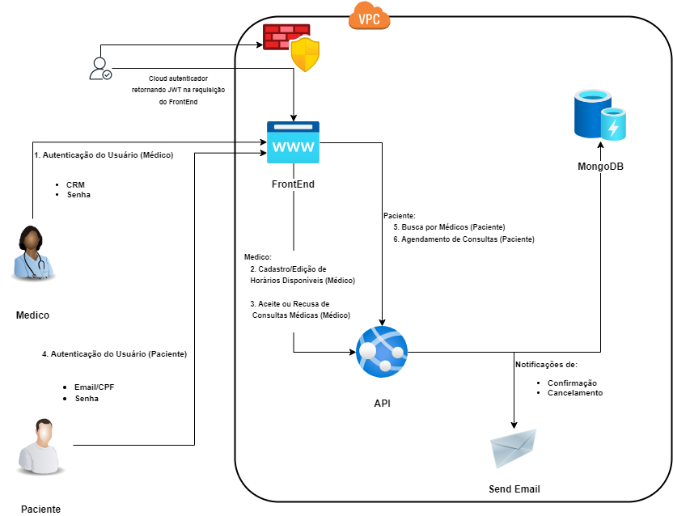

<h1 align="center">Hackathon - Turma 4SOAT - Grupo 68</h1>

A Health&Med, uma startup inovadora no setor de saúde, está desenvolvendo um novo sistema que irá revolucionar a Telemedicina no País. Atualmente, a startup
oferece a possibilidade de agendamento e realização de consultas online (Telemedicina) por meio de sistemas terceiros, como Google Agenda e
Google Meetings.  
Recentemente, a empresa recebeu um aporte e decidiu investir no desenvolvimento de um sistema proprietário, visando proporcionar um serviço de
maior qualidade, segurança dos dados dos pacientes e redução de custos. O objetivo é criar um sistema robusto, escalável e seguro que permita o
gerenciamento eficiente desses agendamentos e consultas.  
Além de conter as funcionalidades de agendamento e realização de consultas online, o sistema terá o diferencial de uma nova funcionalidade: o Prontuário
Eletrônico. O Prontuário Eletrônico permitirá o armazenamento e compartilhamento de documentos, exames, cartão de vacinas, e outros registros
médicos entre as partes envolvidas, garantindo maior assertividade nos diagnósticos.  
Para viabilizar o desenvolvimento de um sistema que esteja em conformidade com as melhores práticas de qualidade e arquitetura de software, a Health&Med
contratou os alunos do curso (SOAT) para fazer a análise do projeto e a arquitetura do software.

##### 1. Informações do Projeto:

1. **Módulo:** Backend.
1. **Arquitetura:** Arquitetura Monolítica.
1. **Padrões de Codificação:** Hexagonal.
1. **Linguagem:** Java versão 17.
1. **Banco de Dados:** MongoDB.
1. **Container:** Docker.
1. **Orquestrador de Container:** Kubernetes.

##### 2. Desenhos Arquiteturais.

###### 2.1. Requisitos de Infraestrutura.

###### 2.1.1. Arquitetura de Infraestrutura.

Segue abaixo o desenho de infraestrutura definido:

###### 2.2. Requisitos de negócio (problema).

1. Para garantir a escalabilidade da aplicação usamos o conceito de conteinerização através do AWS EKS, como pode ser vista na arquitetura de infraestrura[2.1.1].  
1. Para garantir a disponibilidade 24/7 da aplicação usaremos a Cloud AWS da Amazon. 
1. O banco de dados escolhemos MongoDB. Apesar de haver uma preocupação com a segurança dos prontuários médicos por ser dados sensíveis, 
não houve manifestação acerca de recuperação em caso de falha ou perca, seja por acidente ou criminosa. Nesse contexto escolhemos o MongoDB pensando em uma melhor performasse frente ao banco SQL.

**Lembrete:** Todas as configurações Kubernetes podem ser ajustadas conforme necessidade na pasta [k8s](https://github.com/gleniomontovani/HACKATHON/tree/main/hackathon/k8s)

###### 2.2.1. Solução Arquitetural.
Conforme informado anteriormente[1], o padrão arquitetural definido para esse projeto foi o Monolíto. A arquitetura monolítica é um modelo tradicional de desenvolvimento de software que usa uma base de código para executar várias funções comerciais. Todos os componentes de software em um sistema monolítico são interdependentes devido aos mecanismos de troca de dados dentro do sistema.

Segue abaixo o MVP com base na arquitetura definida:

**Lembrete:** Na imagem pode-se observar nas setas informações das requisições que seguem a mesmas ordem definida nos "Requisitos Funcionais" da documentação apresentada pelo cliente.

###### 2.2.2. Requisitos Não Funcionais.
1. Alta Disponibilidade - Para atender esse item usamos a Cloud AWS Amazon, no qual podemos fazer réplicas usando conteiners. 
1. Escalabilidade - Para o requisitos de estalabilidade, usando o conceito de dockerização e orquestração de conteiner com kubernetes[2.2]. 
1. Segurança - Para trazer segurança, utilizando o AWS Cognito para fazer a autenticação dos usuários. 

##### 3. Configuração e Execução:

1. Primeiro suba a infraestrutura de serviços da AWS como: [EKS, EC2, Cognito e VPC](https://github.com/gleniomontovani/HACKATHON/actions/workflows/create_infra_api.yml).
1. Agora rode a pipeline da [aplicação](https://github.com/gleniomontovani/HACKATHON/actions/workflows/deployment.yml).
1. Para deletar os componentes [rode](https://github.com/gleniomontovani/HACKATHON/actions/workflows/destroy_infra_api.yml).

As infraestrutura de serviços AWS estão com as pipeline configuradas para rodarem de forma manual. Já as pipeline da aplicação rodará com um Pull Request para a branch main.

&nbsp;
---

> * Para utilizar a aplicação, baixe o arquivo [JSON](https://github.com/gleniomontovani/HACKATHON/blob/main/hackathon/Hackathon.postman_collection.json), faça a importação no Postaman e altere a URL para a que foi gerada no Loand Balancer da AWS.
